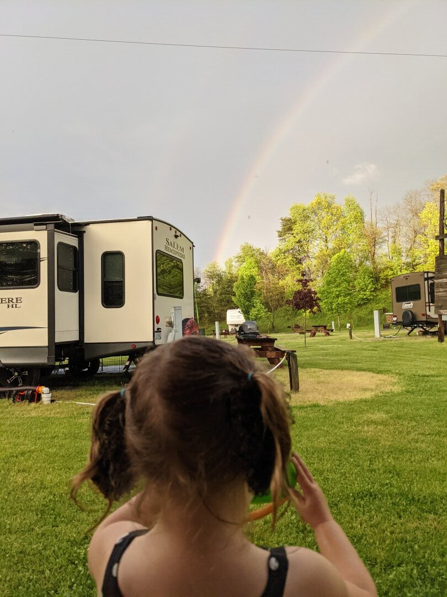
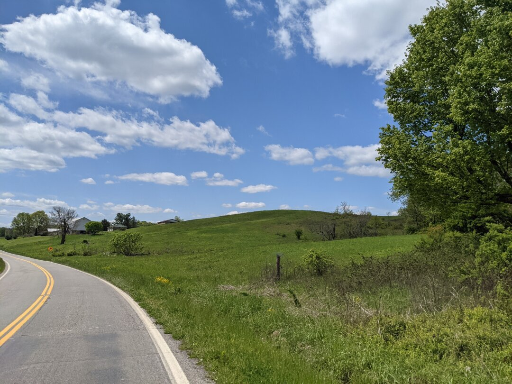
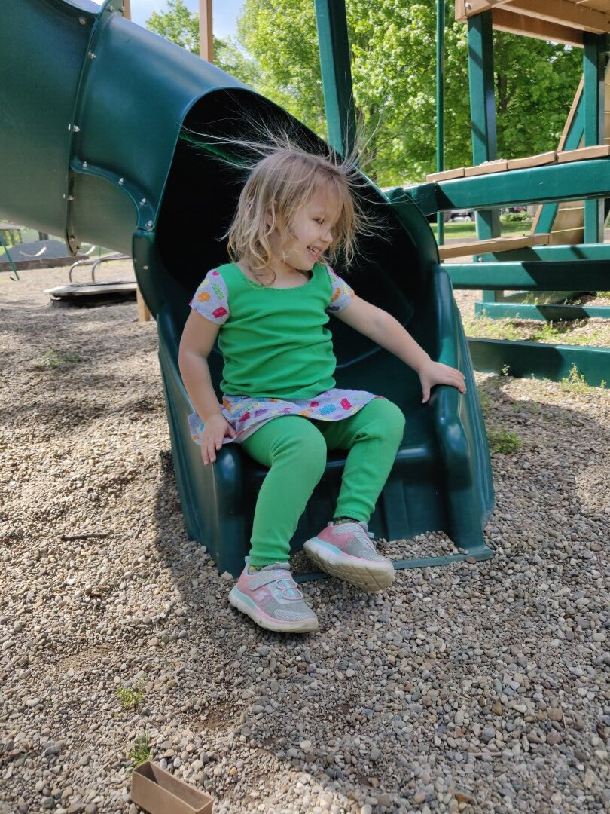
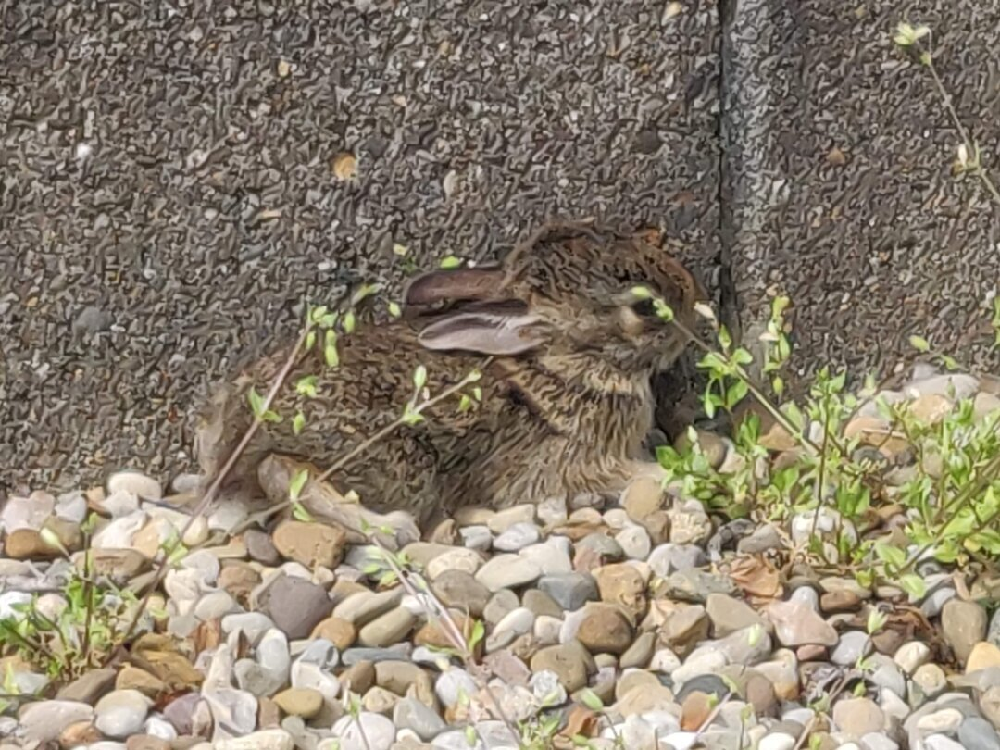
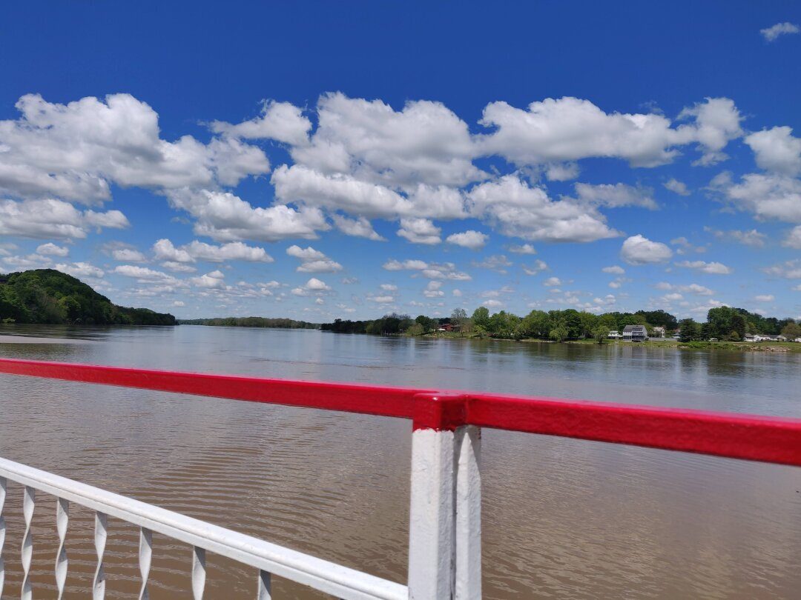
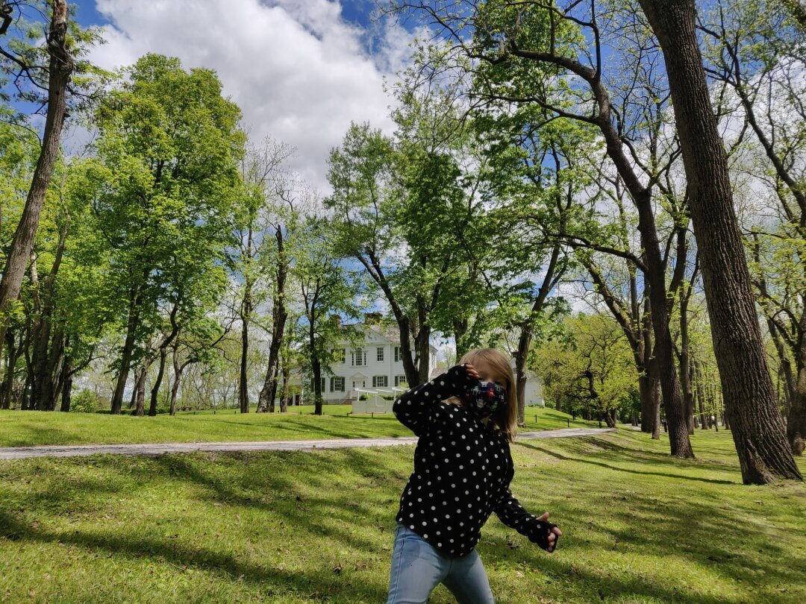
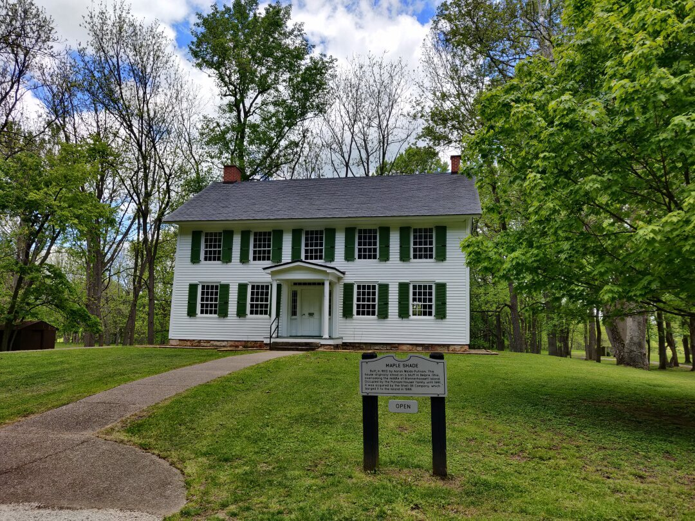
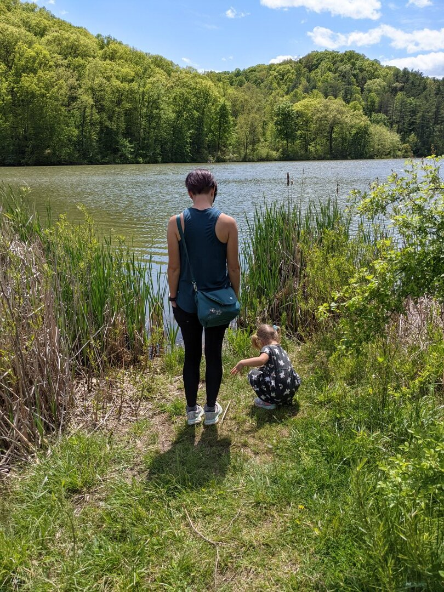
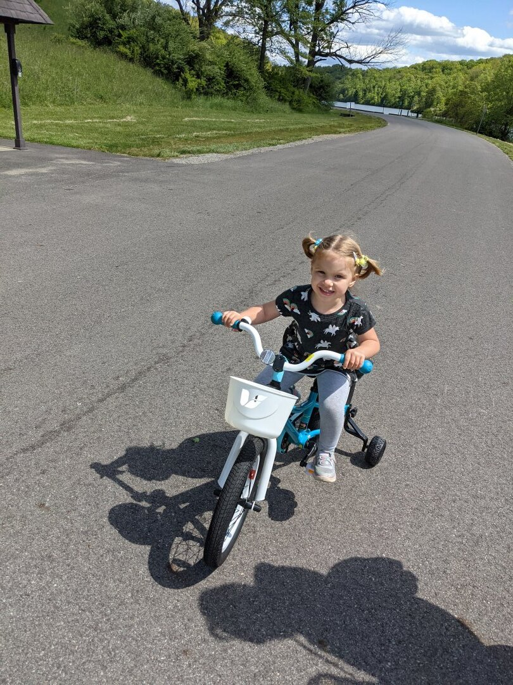
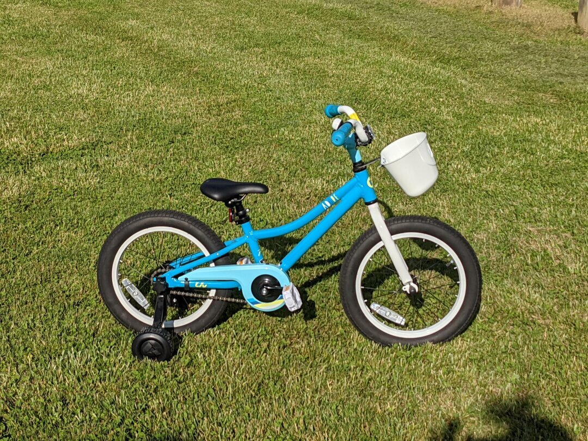

---

date: 2021-05-24
title: Athens County Ohio
author: Rebecca Cole
draft: false
featured_image: posts/2021-05-24/athens.jpg

---

 

We moved to the Athens, Ohio area on May 1st, kicking off our 2021 season. Due to trouble finding RV parks with openings any closer, we stayed in Coolville, Ohio, about 30 minutes away. Our RV park had a playground with a litter of bunnies living under the merry-go-round, so we got to see some baby bunnies and even gave one of them a little pet. Ezri is so good at being gentle with little creatures.

Athens itself has a decent downtown, but we weren't able to find many family friendly stores. Almost all are aimed at college kids instead, so while the downtown is walkable, the store selection just didn't have much of interest to us.

While we were in the area, Ezri and I drove over the border to Parkersburg, West Virginia while James did some work on the RV. We took a boat to Blennerhassett Island, where a few old buildings and a re-creation of the Blennerhassett mansion is. The original mansion burned down in 1811 and they built the re-creation on the original foundation around 1980. We took the horse drawn carriage ride around the island, but decided against paying for the mansion tour as I didn't think Ezri was up for that much standing around and listening. We did get to see the Putnam Houser house for free; they made a few 'windows' so you could see the construction methods and Ezri had fun looking in them.

Ezri got a new bicycle in Athens, which we took to nearby Strouds Run State Park to take advantage of their large parking lots. She's really enjoying having pedals, but we're still working on her pushing hard enough on the pedals to get over small hills or past rocks. She's still too hesitant to try standing up to pedal or putting real force into it.

We are always trying to find better ways to decide whether an area is a good candidate for moving to, and since you are affected by state-level laws, I've started researching the abortion and sex education laws of each state we consider. Ohio is not the best match in that regard, so I don't see it being a contender for where we end up. On May 15th we headed to our next stop, State College, Pennsylvania.