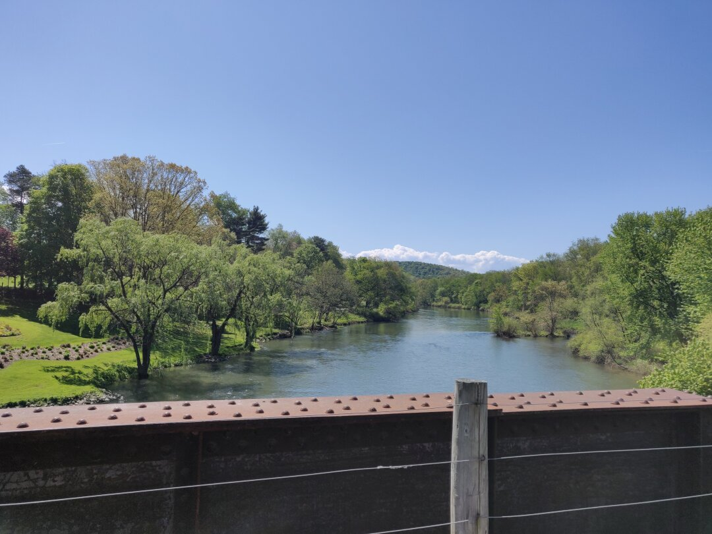
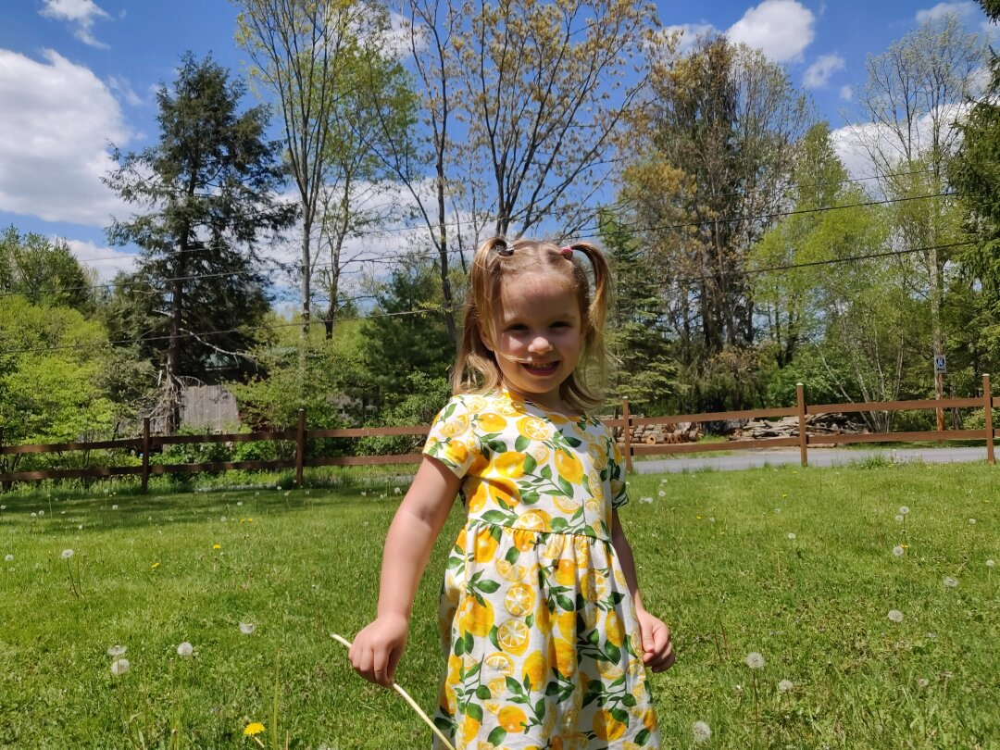
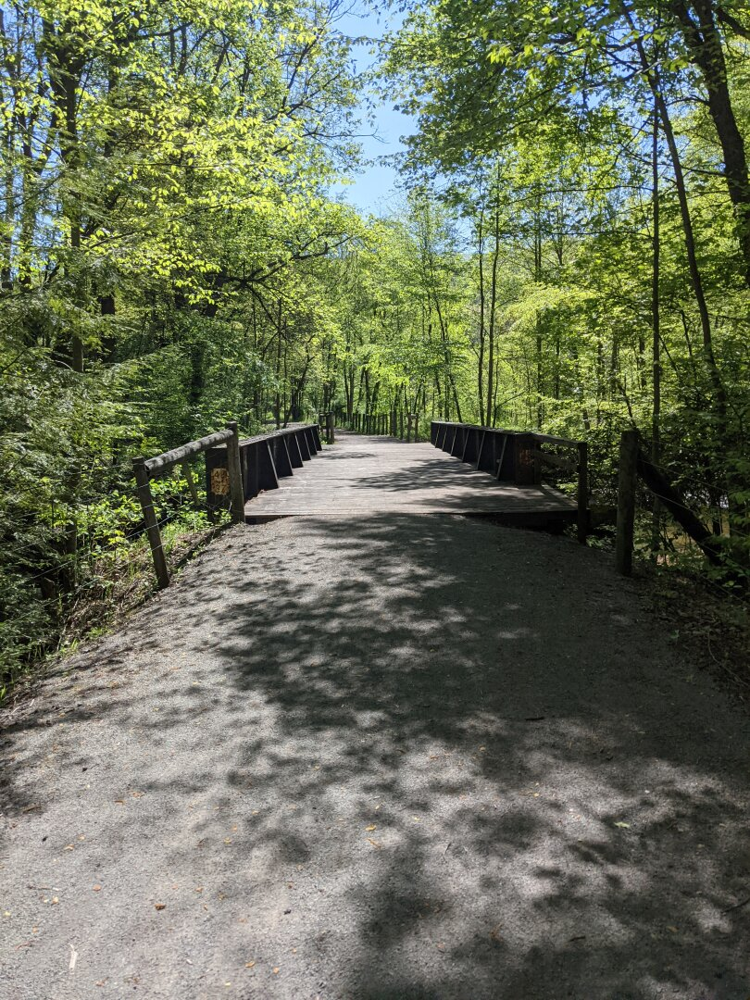
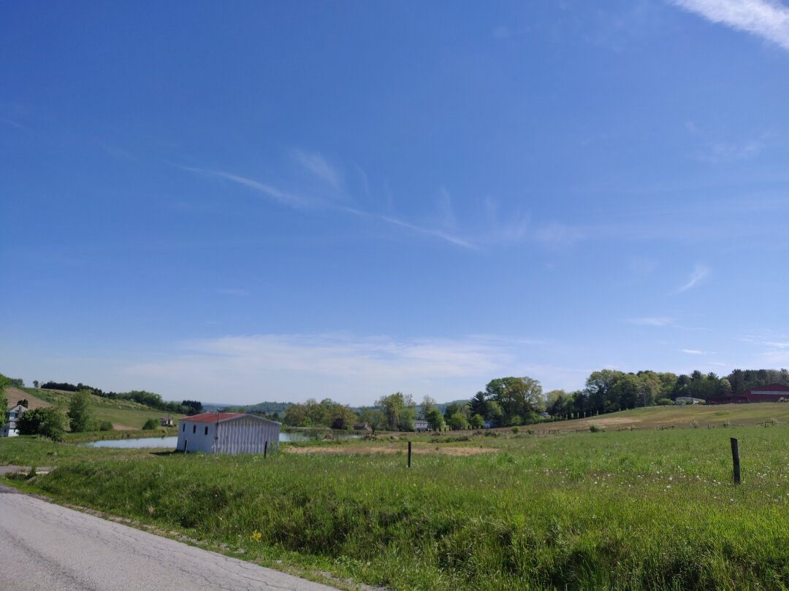
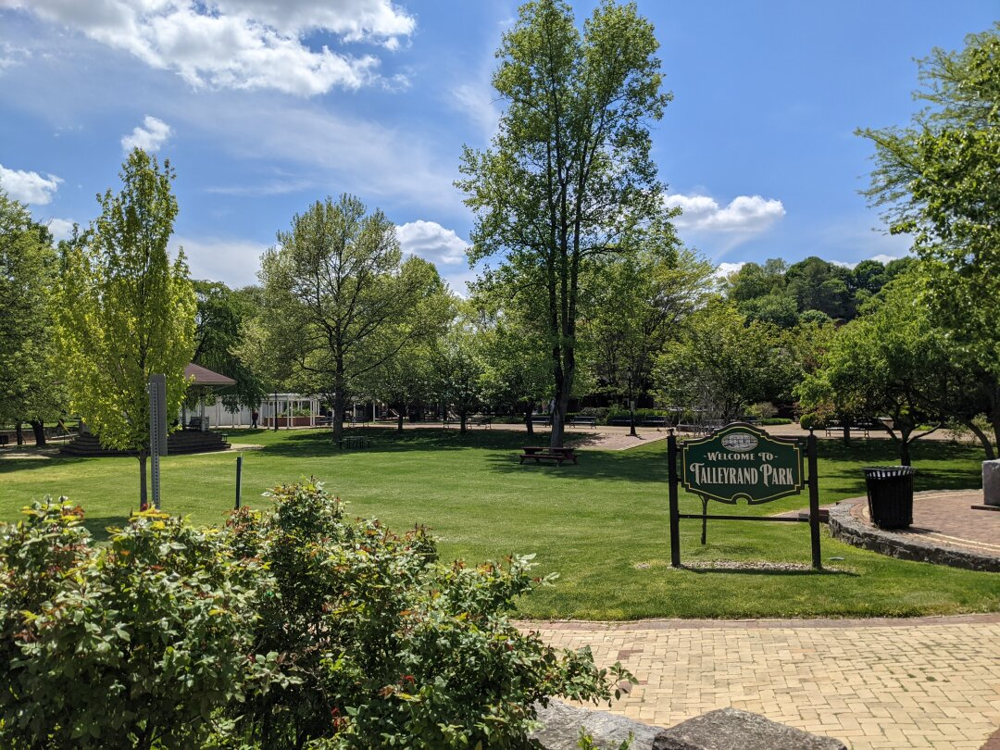
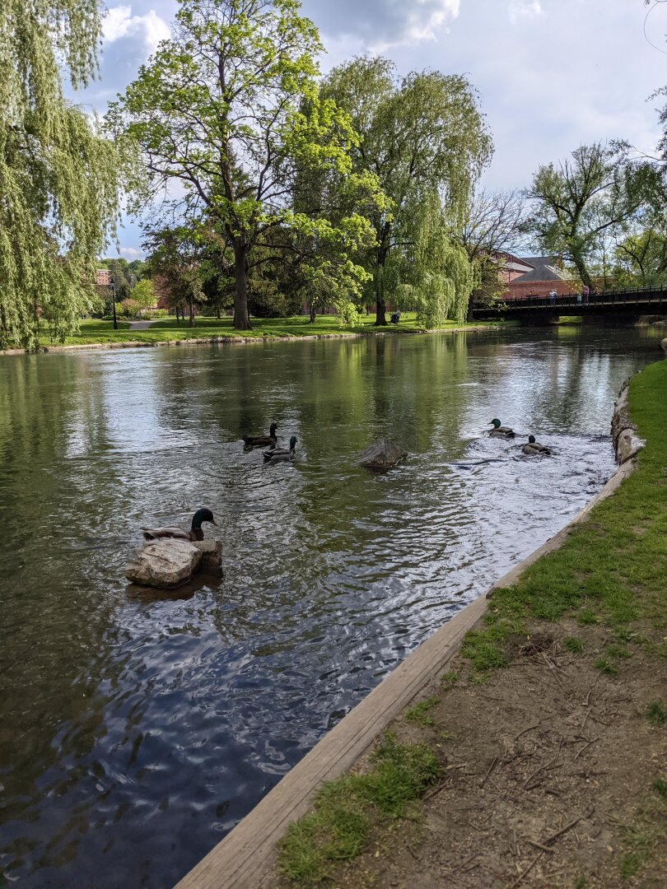
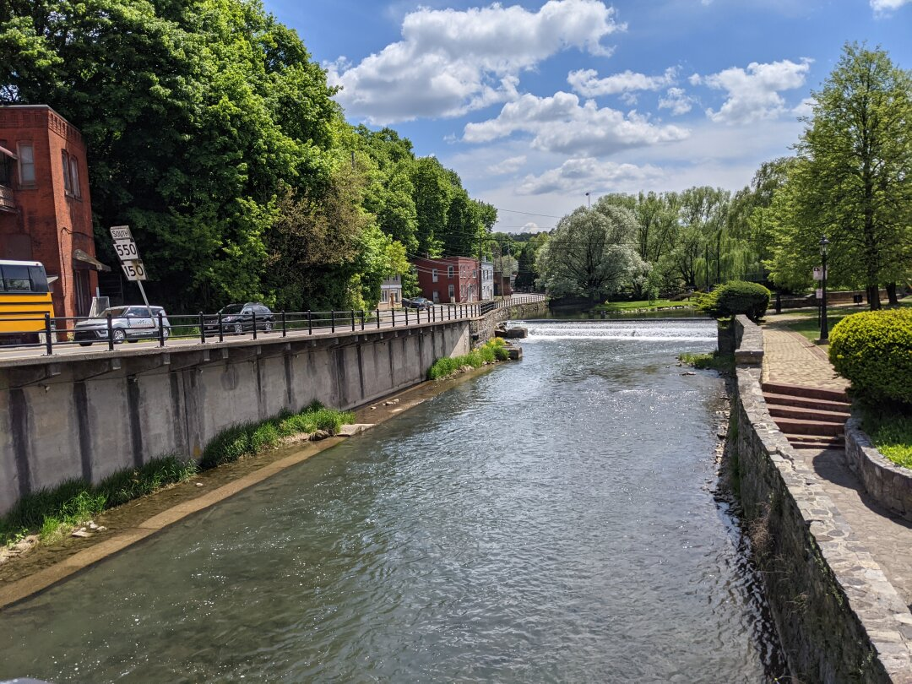
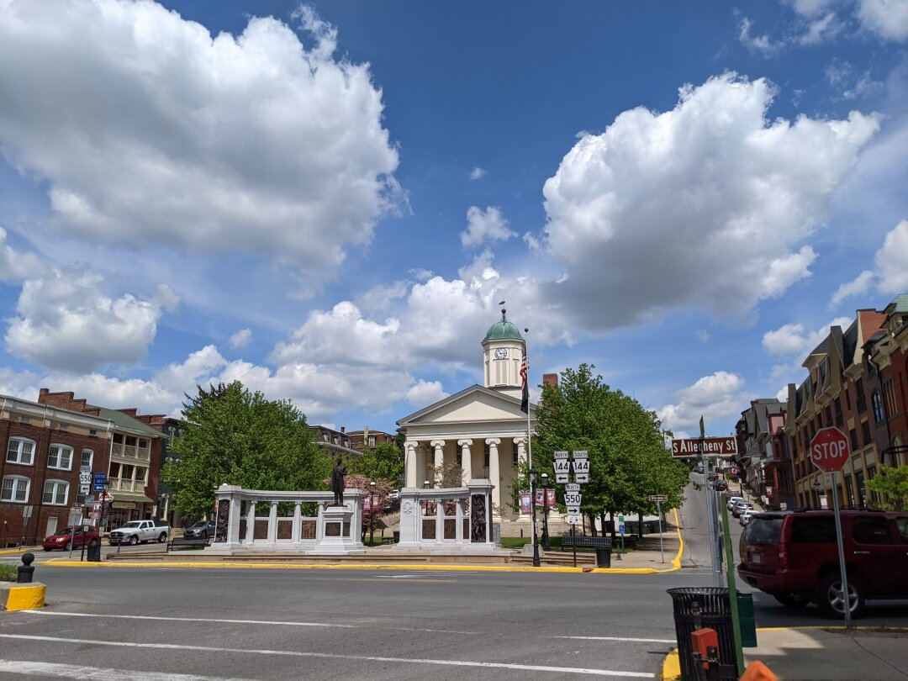
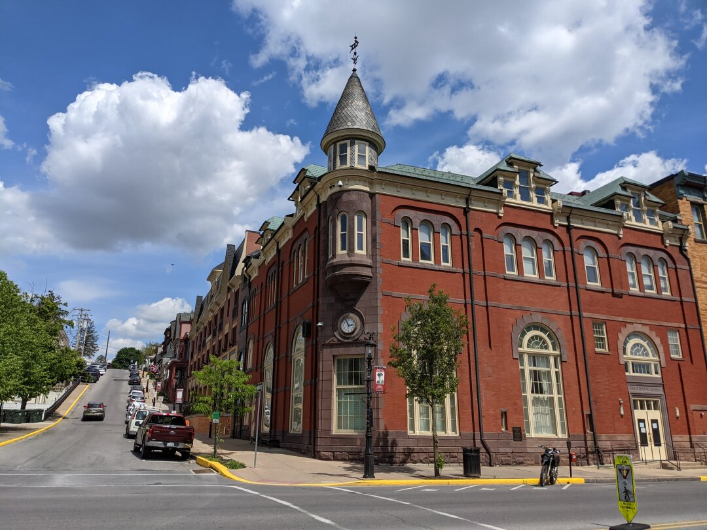
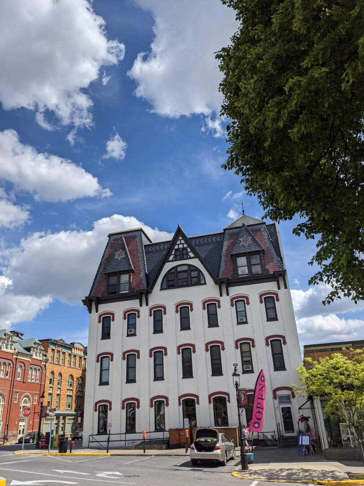

---

date: 2021-06-04
title: Centre County Area Pennsylvania
author: Rebecca Cole
draft: false
featured_image: posts/2021-06-04/pennsylvania.jpg

---

Due to the lack of available spaces, we ended up staying in an RV Park in Woodland, PA, near Clearfield, and had to leave on Friday since the upcoming long weekend had the place fully booked for that night. The park has a good playground, a sandbox, a pond with a path circling it, and a few paths cut into the surrounding woods. We had many walks that I intended to be on those wooded paths, but that Ezri quickly insisted should instead become a walk to the playground.

We had 2 major areas we wanted to look at, the first being State College (home of Penn State). We found that the city has the college front and center, so much so that there isn't much else there. We couldn't find a real downtown to go through, and property prices are quite high in the area.

Nearby is Bellefonte (pronounced bell-font), which we liked a lot more. They have a cute, walkable downtown, and a great park that has bridges, walking trails, and a playground. We enjoyed checking it out and of course spent much of our time at the playground. The people we spoke to were very friendly and said the school system is very good and that the area is 'very safe'. We have found that a mention of an area being safe is a good indicator that someone follows news sources that like to claim all the cities are burning.

Pennsylvania doesn't get a passing grade on our requirement for state law as a whole (we would have to think this was the best place ever to overlook it). So while we found some nice things, I don't think this will be a contender for our final home. Onward to New York state!

