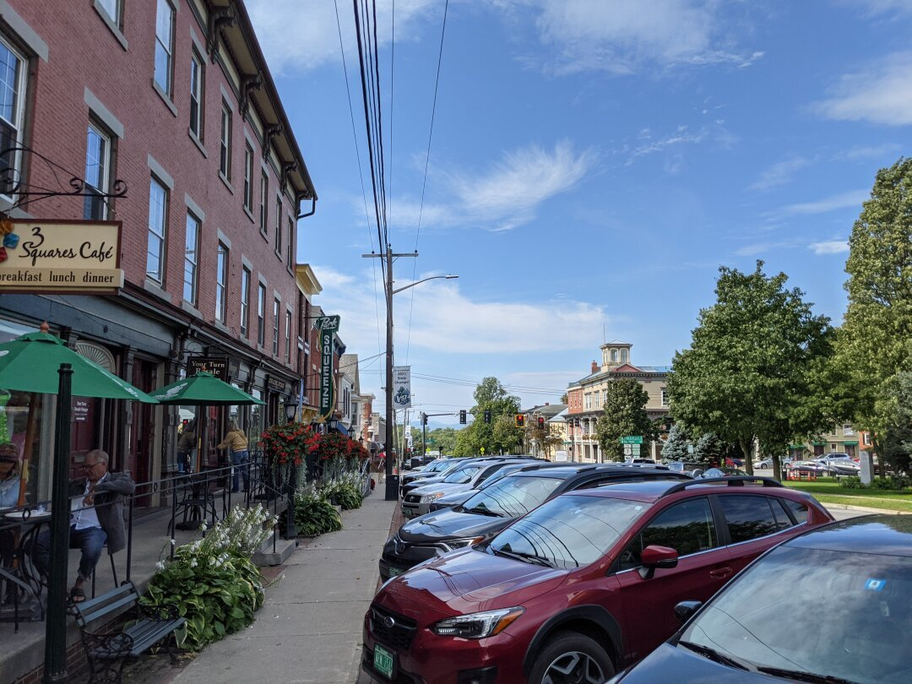

---

date: 2021-10-13
title: New Hampshire and Vermont Pt 2
author: Rebecca Cole
draft: false
featured_image: posts/2021-10-13/nh.jpg

---

## Southern New Hampshire (Aug 21 - Sep 4)

For our second taste of New Hampshire, we stayed in an RV park in New Boston. It's a small town of almost 6k people, but doesn't have as many stores/restaurants as you'd expect for that population size. The RV Park is really big and has 2 playgrounds, which Ezri insisted we visit often. We also visited nearby Milford, a town of about 15k, but it didn't really speak to us.

We also drove out to Concord, the nearby big city. It has a lot of great amenities, and we visited the McAuliffe-Shepard Discovery Center together. They are space focused and even have a Planetarium show. We had tried a planetarium show about a year ago, but Ezri got too scared in the dark and we had to leave within minutes of the show starting. This time, she made it through the entire 45 minute show, and really enjoyed it. 

While we were in the area, the County Faire took place in nearby Hopkinton. We started by looking at the livestock, we really enjoyed seeing all the different breeds of chickens. They also had a monster truck show that we were considering attending, but were worried about the noise level. We lucked out that our ferris wheel ride was timed perfectly to get a free peek, and we were able to confirm it was entirely too loud for Ezri. We'll need to invest in some serious ear protection for her in order to see one up close. Ezri rode a few rides, and went through 2 fun houses. She also insisted on eating 2 root beer floats and a bag of cotton candy.

Our top choice in the state is Keene, which has about 23k people. We wouldn't be able to find land within the city limits, but in one of the surrounding towns about 10 minutes away. They have a great downtown, good running and cycling communities, and a good sized farmer's market. The schools in Keene itself range from 4 out of 10 to 6 out of 10, but the rules vary in the surrounding towns on whether they attend Keene or another school district.

While we were near Claremont New Hampshire again, we stopped to visit some amazing homesteaders running a small farm called [Winter Street Farm](https://www.winterstreetfarm.com/) on the way to Springfield Vermont. They have a three year head-start on a lot of the things we plan to do once we settle down, so it was great to learn about things like [CSA (Community Supported Agriculture)](https://www.visitnh.gov/agriculture/farm-to-fork/csa) and what to look for in land. They definitely gave us some great information and tried to convince us that this area of New Hampshire was the place to be! We would love to end up in the same area as them to hang out more in the future. Unfortunately we forgot to take pictures of their farm, but here are some pictures of Springfield.

## Western Vermont (Sep 4 - Sep 18)

For our second stay in Vermont, we were in an RV park in Leicester (pronounced Lester), which doesn't have a real town center. Just 5 mins to the south though, is Brandon, which is a town of just under 4k people. They have a pretty good downtown, and a nice farmer's market. The schools in the area are not the best, with elementary getting a 4 out of 10 and high school getting a 2 out of 10.

The main town we were looking forward to checking out, Middlebury, is a small town of over 8k people. They have a great downtown with a beautiful river running through it. We talked to a young family at a cafe overlooking the water that just love living there, and Ezri found a giant Adirondack chair to play on. 

We also drove to the elementary school to use the playground, and met a mom and daughter, Sarah and Attalyn, that we really get along well with. We met up with them again to take a hike on a local trail, and grabbed A&W together afterwards. If we end up in this area, it's nice to know we already have a few friends. The schools in the area are pretty nice, ranging between 5 out of 10 and 8 out of 10.

Nearby is Vergennes, with a population of 2,500. It has a cute downtown with very nice people. Vergennes also has a river running through it, with some really pretty falls. With being smaller, it doesn't have as much selection in the downtown as Middlebury, but it is still very walkable. The schools in the area are decent, with elementary scoring 3 out of 10 and high school 6 out of 10.

Another nearby town is Bristol, with a population of almost 4k people. We also really like the downtown, and got talking to one of the shop owners who is on the town planning committee. It was really great to talk to someone so passionate about the direction of the town, and hear about the ideas they are pushing for, like increased infrastructure to support cycling and pedestrians. Another interesting thing in Bristol is the Village Co-housing http://www.bristolcohousing.com/. It's a concept we've come across a couple times before, but it's basically a group of families that live on the same land in their own houses, but with shared outdoor and large gathering space. We discovered the local toy shop owner lives in the Co-housing, and they sometimes have short term apartment space available. If we decide to return to this area, we'll be checking into whether or not we can stay there for a bit. The schools in Bristol are good, the elementary scored 4 out of 10 and high school 5 out of 10.

In general, around Vergennes, Middlebury, and Bristol, there is a lot of infrastructure in place for cycling, and everywhere we looked there were cyclists and runners. Since the more runners and cyclists, the safer it is to get out there, it's something we're probably going to weigh heavily in our decision.

The 'big city' in the area is Rutland, with a population of about 20k people (there's 2 Rutlands so I added the pops together). There's a regional airport, and the biggest farmer's market we've ever been to. Ezri got a snow cone that was made by a girl hand cranking out the ice, and we got some mead to try as well. They have your standard big city stuff, and a pretty nice downtown. There's a makerspace and a children's museum that we didn't make it out to see, if we go back through the area we'll probably stop in for both of those. It's definitely a larger city feel than we want to live in, but great to have as a nearby amenity.

### Next Up

Next stop is Ithaca New York on the way to our holiday destination.